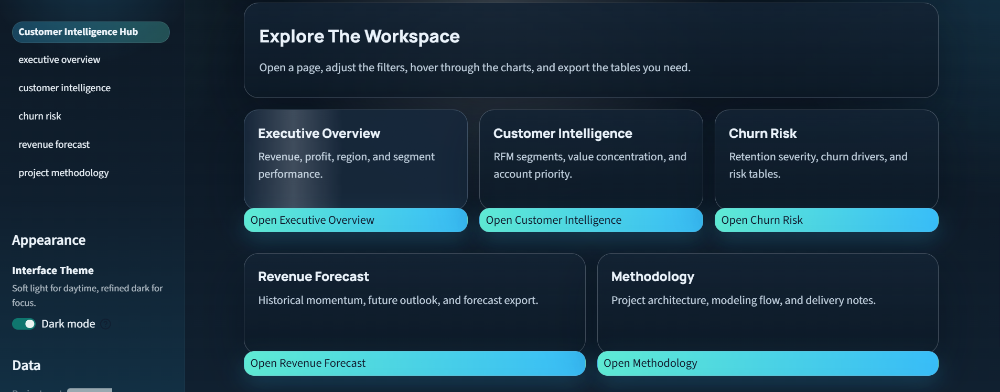
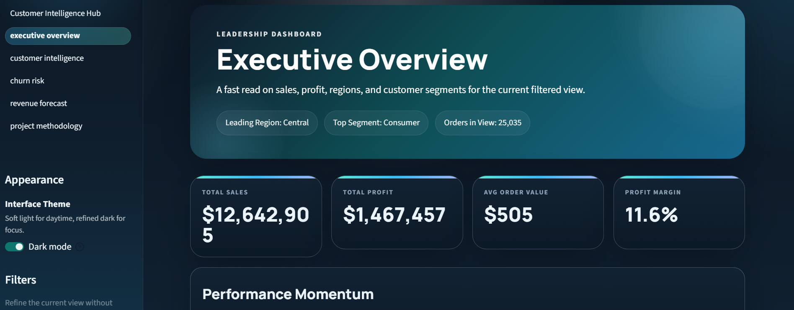

<h1 align="center">Customer Intelligence & Revenue Forecasting System</h1>

<p align="center">
  <strong>A retail analytics dashboard that turns order history into executive KPIs, customer segments, churn-risk signals, and revenue forecasts.</strong>
</p>

<p align="center">
  <a href="https://customer-intelligence-revenue-optimization-system-mhvrwsynfhxa.streamlit.app">
    
  </a>
  
  
  
</p>

---

## Overview

Retail teams often know total sales but struggle to see which customers matter most, where churn risk is building, and what revenue may look like next. This project connects those questions in one workflow: clean the data, build customer intelligence features, score risk, forecast revenue, and present the results in an interactive dashboard.

The project includes a reusable Python pipeline, dashboard-ready CSV outputs, Power BI design assets, and a polished multi-page Streamlit web application.

---

## Live Demo

> **🌐 [Open the Live App →](https://customer-intelligence-revenue-optimization-system-mhvrwsynfhxa.streamlit.app)**

---

## Website Views

### Homepage

The landing page introduces the platform and provides navigation to all analytics pages. Supports both light and dark themes.

<table>
  <tr>
    <td><strong>Light Mode</strong></td>
    <td><strong>Dark Mode</strong></td>
  </tr>
  <tr>
    <td></td>
    <td></td>
  </tr>
</table>

<details>
<summary><strong>More Homepage Views</strong></summary>
<br>

**Workspace Navigation**



</details>

---

### Executive Overview

Track sales, profit, order volume, regional mix, and segment performance at a glance.



<details>
<summary><strong>More Executive Overview Views</strong></summary>
<br>

**Performance Momentum — Monthly Sales & Profit Trends**


**Commercial Mix — Top Regions & Sales by Segment**


</details>

---

### Customer Intelligence

Explore RFM segments, customer value concentration, and account-level priority tables.


<details>
<summary><strong>More Customer Intelligence Views</strong></summary>
<br>

**RFM Segment Distribution & Revenue Share**


**Customer Distribution — Recency vs Revenue & Frequency vs Revenue**


</details>

---

### Churn Risk

Find customers with higher churn risk and decide who needs attention first.


<details>
<summary><strong>More Churn Risk Views</strong></summary>
<br>

**Churn Probability Distribution & Customers by Risk Band**


**Highest-Risk Customers Table**


</details>

---

### Revenue Forecast

Compare recent revenue with the forecast window and use it for planning targets.


<details>
<summary><strong>More Revenue Forecast Views</strong></summary>
<br>

**Historical vs Forecast Revenue & Trend Comparison**


**Weekly Forecasted Revenue & Recent Historical Revenue**


**Future Insights & Forecast Horizon Preview**


**Forecast Data Table & Planning Recommendations**


</details>

---

## Business Questions

This project is built to answer:

- Where are sales and profit coming from?
- Which customer segments create the most value?
- Which customers are most likely to churn?
- Which behavior signals appear connected to churn risk?
- What revenue should the business plan for in the next forecast window?

---

## Solution Approach

```
Raw Data → Clean & Transform → Feature Engineering → Modeling → Export → Dashboard
```

1. Load and inspect raw retail transaction data
2. Clean column names, dates, numeric fields, and reusable features
3. Create executive KPI and EDA outputs
4. Build RFM customer segments
5. Estimate churn risk from customer behavior
6. Forecast daily revenue for the planning window
7. Export clean CSV files for Streamlit and Power BI
8. Present insights through an interactive dashboard

---

## Tools & Technologies

| Category | Tools |
|---|---|
| **Language** | Python |
| **Data** | pandas, NumPy, openpyxl |
| **Machine Learning** | scikit-learn |
| **Visualization** | Plotly, matplotlib, seaborn |
| **Dashboard** | Streamlit |
| **BI** | Power BI |

---

## Key Deliverables

- ✅ Reusable Python pipeline scripts
- ✅ Structured analytics notebooks
- ✅ Dashboard-ready CSV outputs
- ✅ Four-page Streamlit analytics website with dark/light mode
- ✅ Power BI dashboard specification and DAX assets
- ✅ Project documentation for planning, dashboard design, and business insights

---

## Repository Structure

```text
├── data/
│   ├── raw/                Source dataset
│   ├── cleaned/            Cleaned canonical dataset
│   └── processed/          App-ready intermediate exports
│
├── notebooks/              Analysis workflow from loading to forecasting
├── scripts/                Reusable ETL, RFM, churn, forecasting, and export logic
│
├── outputs/
│   ├── csv/                Final CSV outputs
│   ├── models/             Trained model files
│   └── images/             Visual assets
│
├── powerbi/                DAX measures, theme, and dashboard design assets
├── webapp/                 Deployable multi-page Streamlit website
├── docs/                   Project plan, dashboard specification, and business insights
├── assets/                 Website screenshots
└── requirements.txt        Python dependencies
```

---

## Main Outputs

| File | Description |
|---|---|
| `outputs/csv/cleaned_orders.csv` | Cleaned and enriched order data |
| `outputs/csv/executive_summary.csv` | Executive KPI summary |
| `outputs/csv/rfm_table.csv` | RFM customer segmentation |
| `outputs/csv/churn_predictions.csv` | Churn probability per customer |
| `outputs/csv/revenue_forecast.csv` | Daily revenue forecast with confidence bands |

---

## How To Run Locally

```bash
# 1. Install dependencies
pip install -r requirements.txt

# 2. Run the data pipeline
python scripts/run_pipeline.py

# 3. Launch the dashboard
streamlit run webapp/Customer_Intelligence_Hub.py
```

---

## Deployment

The app is deployed on **Streamlit Community Cloud**.

| Setting | Value |
|---|---|
| **Entry point** | `webapp/Customer_Intelligence_Hub.py` |
| **Branch** | `main` |
| **Live URL** | [customer-intelligence-revenue-optimization-system-mhvrwsynfhxa.streamlit.app](https://customer-intelligence-revenue-optimization-system-mhvrwsynfhxa.streamlit.app) |

The app uses repository-relative paths and cached CSV loading, so it runs both locally and on Streamlit Cloud after the pipeline outputs are available.

---

## Business Impact

The dashboard helps decision-makers:

- 📊 Monitor sales, profit, and margin quality
- 👥 Identify high-value customers and segments
- ⚠️ Prioritize churn-risk outreach
- 🎯 Review customer-level retention targets
- 📈 Plan around forecasted revenue
