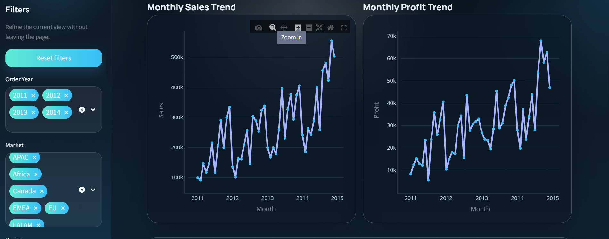
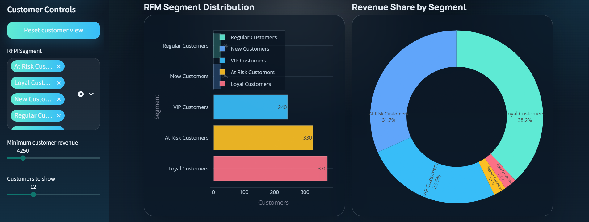
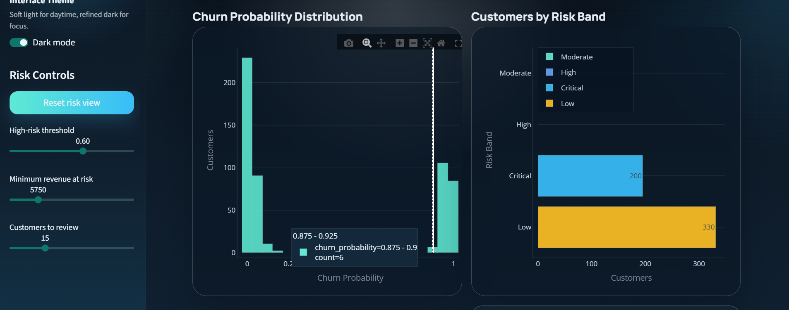

# Customer Intelligence & Revenue Forecasting System

A retail analytics dashboard that turns order history into executive KPIs, customer segments, churn-risk signals, and revenue forecasts. The project includes a reusable Python pipeline, dashboard-ready CSV outputs, Power BI design assets, and a polished Streamlit website.

## Project Overview

Retail teams often know total sales, but struggle to see which customers matter most, where churn risk is building, and what revenue may look like next. This project connects those questions in one workflow: clean the data, build customer intelligence features, score risk, forecast revenue, and present the results in an interactive dashboard.

## Website View

The Streamlit website is organized around four business views:

- **Executive Overview**: sales, profit, order volume, regional mix, and segment performance.
- **Customer Intelligence**: RFM segments, customer value concentration, and top customer tables.
- **Churn Risk**: churn probability distribution, high-risk customers, and risk drivers.
- **Revenue Forecast**: historical revenue, forecast horizon controls, confidence bands, and exportable forecast preview.

### Examples (Screenshots)

**Executive Overview**

- Light mode: 
  .png)
- Dark mode:
  .png)

**Customer Intelligence**



**Churn Risk**



**Revenue Forecast**



Run the website locally:

```bash
streamlit run webapp/Customer_Intelligence_Hub.py
```

## Business Questions

This project is built to answer:

- Where are sales and profit coming from?
- Which customer segments create the most value?
- Which customers are most likely to churn?
- Which behavior signals appear connected to churn risk?
- What revenue should the business plan for in the next forecast window?

## Solution Approach

1. Load and inspect raw retail transaction data.
2. Clean column names, dates, numeric fields, and reusable features.
3. Create executive KPI and EDA outputs.
4. Build RFM customer segments.
5. Estimate churn risk from customer behavior.
6. Forecast daily revenue for the planning window.
7. Export clean CSV files for Streamlit and Power BI.
8. Present insights through an interactive dashboard.

## Tools

- Python
- pandas and NumPy
- scikit-learn
- Plotly
- Streamlit
- matplotlib and seaborn
- Power BI

## Key Deliverables

- Reusable Python pipeline scripts
- Structured analytics notebooks
- Dashboard-ready CSV outputs
- Four-page Streamlit analytics website
- Power BI dashboard specification and DAX assets
- Project documentation for planning, dashboard design, and business insights

## Repository Structure

```text
data/
  raw/            source dataset
  cleaned/        cleaned canonical dataset
  processed/      app-ready intermediate exports

notebooks/        analysis workflow from loading to forecasting
scripts/          reusable ETL, RFM, churn, forecasting, and export logic
outputs/          final CSV outputs, model files, and visual assets
powerbi/          DAX measures, theme, and dashboard design assets
webapp/           deployable multi-page Streamlit website
docs/             project plan, dashboard specification, and business insights
```

## Main Outputs

- `data/processed/cleaned_orders.csv`
- `data/processed/executive_kpis.csv`
- `data/processed/forecast_input_daily_sales.csv`
- `outputs/csv/rfm_table.csv`
- `outputs/csv/churn_predictions.csv`
- `outputs/csv/revenue_forecast.csv`

## How To Run Locally

```bash
pip install -r requirements.txt
python scripts/run_pipeline.py
streamlit run webapp/Customer_Intelligence_Hub.py
```

## Deployment

The Streamlit entry point is:

```text
webapp/Customer_Intelligence_Hub.py
```

The app uses repository-relative paths and cached CSV loading so it can run locally or on Streamlit Community Cloud after the pipeline outputs are available.

## Business Impact

The dashboard helps decision-makers:

- monitor sales, profit, and margin quality
- identify high-value customers and segments
- prioritize churn-risk outreach
- review customer-level retention targets
- plan around forecasted revenue
